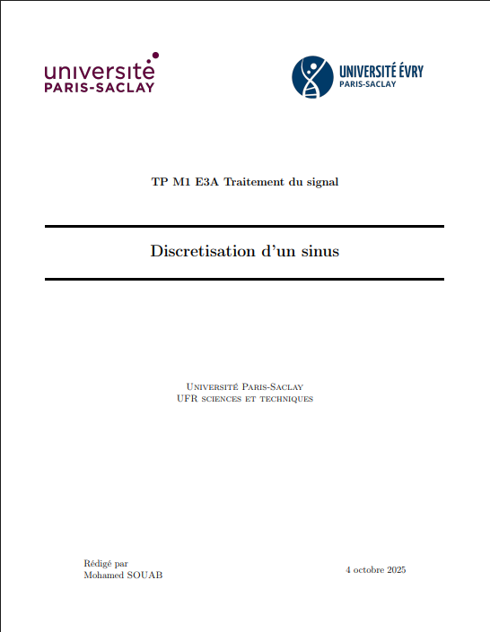

# LaTeX Lab Report Template

## Purpose

This template was created to streamline the process of creating lab reports by eliminating the common challenges faced when writing scientific documentation. The aim is to cut down on frequent document layout adjustments and create artistic and layout-unified lab reports while saving time. By providing a solid foundation, i can focus on the content rather than wrestling with formatting issues.

The template includes clean and professional layout with pre-configured sections for lab reports, code highlighting support with Minted, mathematics and equation formatting, and figure integration. The modular structure allows for easy customization while maintaining consistency across all documents.

## Template Structure

The template is organized with `main.tex` as the main document file and `TP.tex` for lab report content. The Base folder contains template configuration files including `package.tex` for LaTeX packages and settings, `command.tex` for custom commands, and `page_de_garde.tex` for the title page template. Additional folders include logos for university and pics for images and figures.

## Screenshots

## PDF Preview

[View sample PDF output](https://drive.google.com/file/d/11LC9GJUnT_5VBBIQDu7puV8b_ZW-NDOL/view?usp=sharing)
